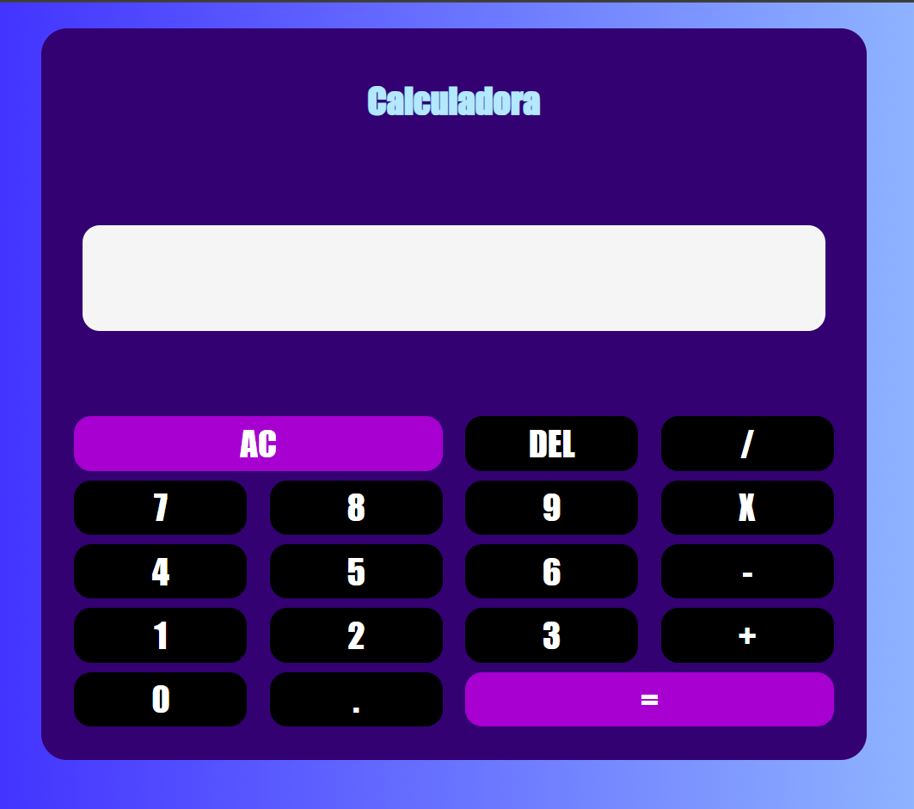

## Sobre o projeto 📚

    
Calculadora Básica

    
Projeto desenvolvido para estudo de JavaScript, CSS e HTML. Calculadora está totalmente responsiva

    
O link da calculadora <a href="https://andreimartinscoelho.github.io/Calculadora-Basica-JS/">aqui</a>.

    Tecnologias utilizadas
    <ul>
        <li>HTML</li>
        <li>CSS</li>
        <li>JavaScript</li>
    </ul>
    Aqui está uma prévia do projeto
    

